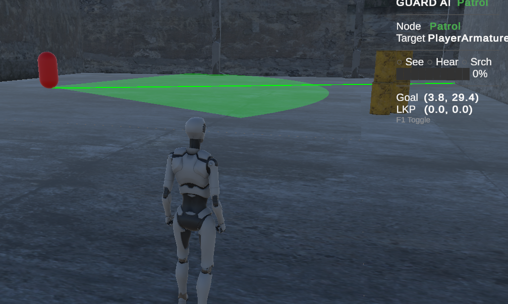
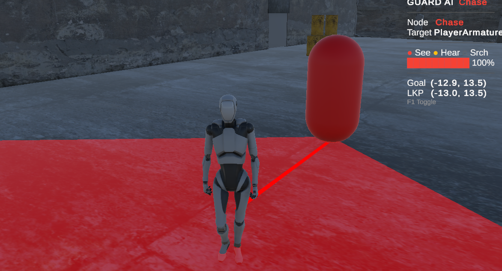
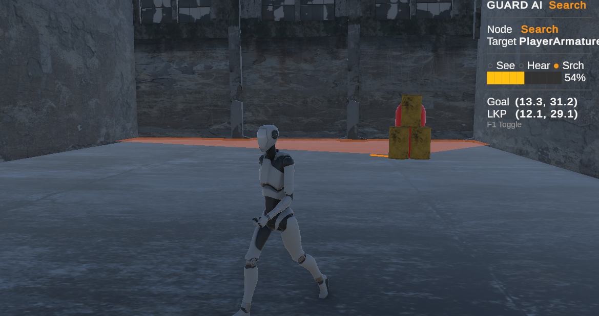

# Evidence Log

## Session 1 — Saturday 21 Mar 2026

Before starting on the BT I went through the CA1 feedback and fixed the issues that were flagged. The main ones were GoalZone using GetComponent instead of a serialized reference and the catch bug where running into the guard didn't properly trigger the lose screen. Also added a Tooltip on the VisionCone raycount to document the performance cost since the marker flagged that too.

**Commit:** `5b0a1b8`

From there I built the BT framework from scratch. Wrote the base node class along with Sequence and Selector composites and the three decorators and the Blackboard. Decided against using a library since it's small enough to write by hand and I wanted to understand every part of it.

**Commit:** `d0d20c1`

Once the framework was in I built out the actual behaviours. The four leaf nodes and the tree construction in GuardBT and the SuspicionSystem that drives the transitions. Got the first playable version running by the end of the session. It mostly worked but there was a noticeable oscillation where the guard kept flipping between Chase and Search because hearing was re-triggering chase during an active search.

**Commit:** `5a6cabf`

Spent the last stretch of the session tracking down the oscillation. The chase timer wasn't resetting when hearing was active and the stuck detection wasn't clearing the IsSearching flag properly. Fixed both and cleaned up stale Blackboard values when the player reference is lost.

**Commit:** `7da63bc`

## Session 2 — Sunday 22 Mar 2026

This session was mostly about making the guard actually feel good to play against. The biggest issue was the guard stuttering and barely moving during chase. Turned out the NavMeshAgent defaults were fighting the BT so I set acceleration to 40 and angular speed to 360 and turned off autoBraking which made a huge difference. I also locked the chase destination when the guard loses sight so it commits to one route around obstacles instead of constantly recalculating. Gated chase re-entry with IsSearching so hearing alone can't yank the guard out of a search. Moved the cooldown decorator onto investigate to stop it from spamming and refactored the door to go through GuardMovement properly. Added the waypoint skip for when patrol routes are blocked by the door carve. Finished up by redoing the debug overlay to be more compact and readable.

**Commit:** `76b6b60`

