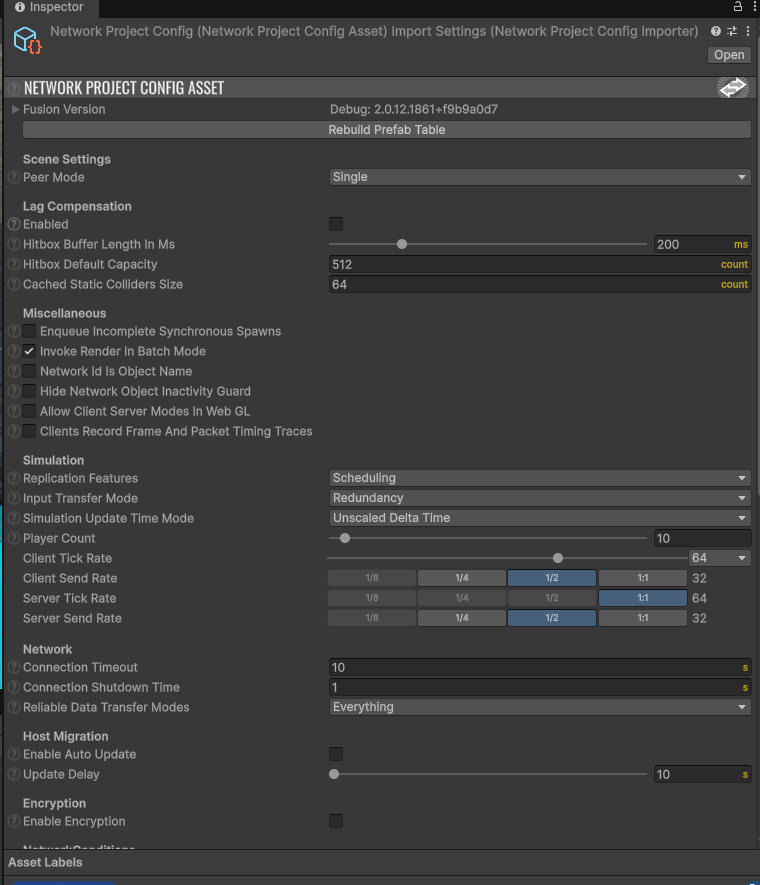
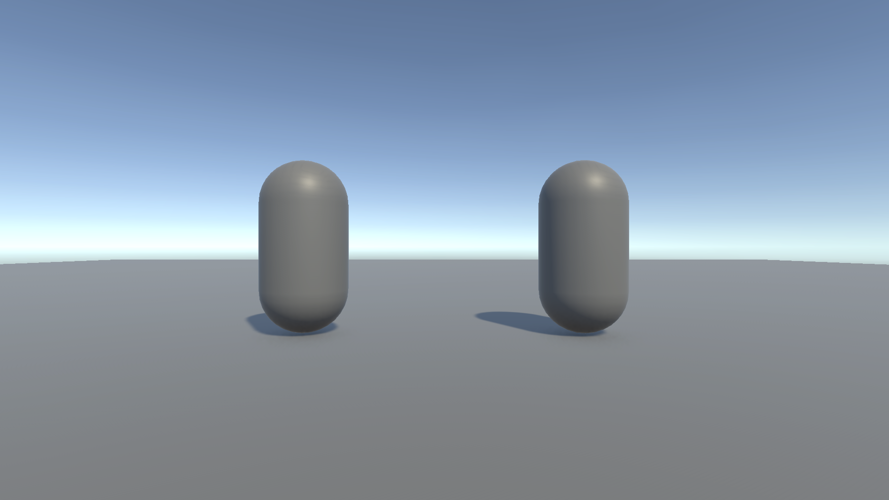
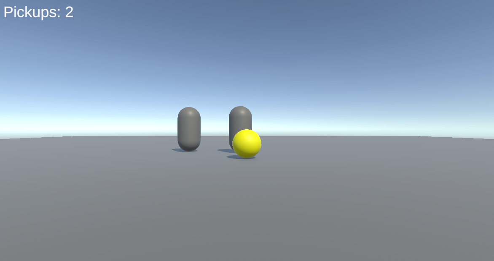
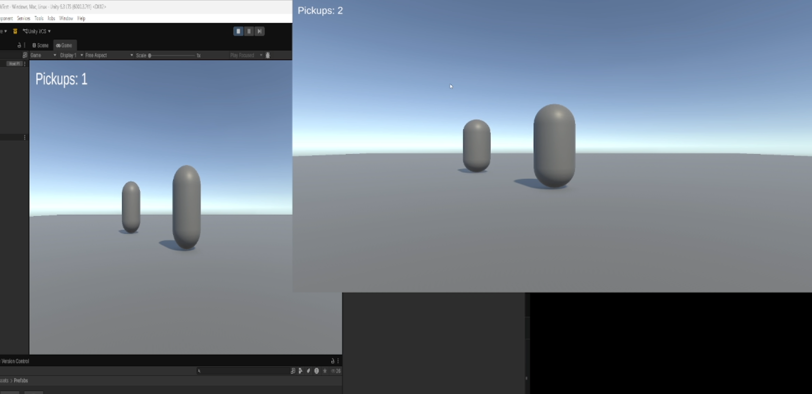
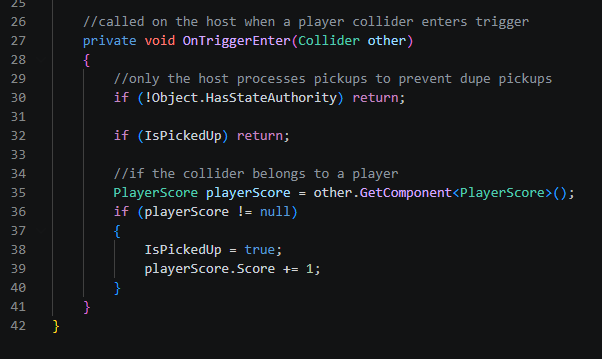
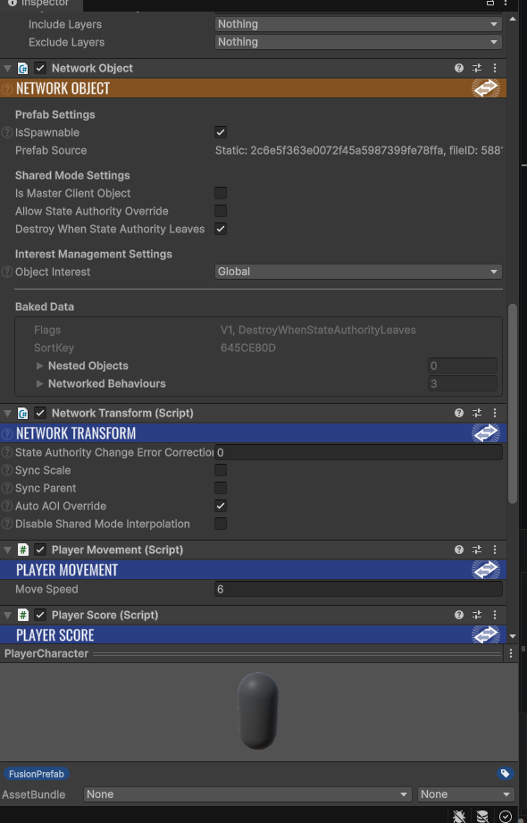

# CA2 Learning Journal

## Weekly Evidence Log

### Weeks 1–5 (19 Jan – 1 Mar)
No commits during this period for the 3D module.

### Week 6 (2–8 Mar)
CA1 was completed and submitted in a single session on March 2nd. This included the Unity project setup, PBR map imports, Shader Graph dissolve effect, Unreal comparison, lighting pass, post-processing, and the final PDF and build. All five commits are from that day.

**Commits:** `7557aeb`, `4ee5ce5`, `35dcc79`, `9798153`, `3e11c27` (all 2026-03-02)

### Weeks 7–8 (9–22 Mar)
No 3D module commits during this period.

### Week 9 (23 Mar – 5 Apr)
All CA2 networking work was done in a single session on April 4th. Imported the Fusion 2 SDK and configured the Photon App ID. Created the CA2_NetworkTest scene with a ground plane. Built the PlayerCharacter prefab with NetworkObject and NetworkTransform components. Wrote the Spawner script implementing INetworkRunnerCallbacks with OnPlayerJoined spawning via `Runner.Spawn()` and OnPlayerLeft cleaning up via `Runner.Despawn()`. Got the two-client baseline working with a standalone build as host and the editor as client.

Built PickupItem.cs with a `[Networked] public NetworkBool IsPickedUp` property and a `HasStateAuthority` guard in OnTriggerEnter so only the host processes pickups. Built PlayerScore.cs with `[Networked] public int Score` and HasInputAuthority-gated UI creation so each client only sees their own score display. Created the PickupOrb prefab with a trigger collider and a yellow material and placed three in the scene.

Blockers hit during the session: the player prefab wasn't registered in NetworkProjectConfig so it didn't appear on the second client, fixed by clicking Rebuild Prefab Table. Hit an InputSystem conflict where `Spawner.OnInput()` used `Input.GetKey()` but the project was set to the new Input System, threw an InvalidOperationException at runtime. Fixed by setting Active Input Handling to "Both". OnTriggerEnter wasn't firing because the player had no Rigidbody, fixed by adding a kinematic Rigidbody with gravity disabled.

**Commits:** `035725d`, `c248622`, `13c977b`, `752520e`, `963daa5`, `aede951`, `dfc71f6`, `10ab101` (all 2026-04-04)

## Critical Discussion

I picked Option B because it gives a binary success condition that is easy to verify. Either the orb disappears on both screens and the score goes up, or it doesn't. This kept testing simple and the scope tight. I avoided Option D (projectiles) because hit detection and latency compensation would have introduced debugging I couldn't confidently finish. Even with the simpler scope I still hit multiple blockers including the InputSystem conflict, the missing prefab registration, and the missing Rigidbody, all of which ate into development time. If I had picked something bigger I would not have finished.

I used `[Networked]` properties for both `IsPickedUp` and `Score` instead of RPCs. The reasoning comes directly from how the code works. In `PickupItem.Render()` every client checks `IsPickedUp` every frame to decide whether to show or hide the orb's renderer and collider. In `PlayerScore.Render()` the local client reads `Score` every frame to update the UI text. Both of these are persistent state that any client needs access to at any time. If I had used an RPC to broadcast that an orb was collected, a client joining after that event would never receive the message and would see the orb still sitting there despite it being gone. `[Networked]` properties solve this because Fusion replicates the current value automatically to all clients including late joiners. RPCs would be the right choice for something transient like a pickup sound effect where only clients present at that moment need to react. I had no transient effects in my scope so I did not need them.

The most important authority decision was in `PickupItem.OnTriggerEnter()`. My first version had no authority check. During two-client testing both the host and the joining client processed the collision at the same time, which meant `IsPickedUp` got set to true twice and `playerScore.Score += 1` ran on both sides, doubling the score for a single pickup. The fix was adding `if (!Object.HasStateAuthority) return;` as the first line of OnTriggerEnter so that only the host processes the collision and writes to the [Networked] properties. The client's collision is ignored entirely and it receives the updated state through Fusion's replication.

If I were to do this again I would start earlier and spread the work across the teaching weeks instead of compressing everything into single sessions. The CA1 and CA2 commit histories both show everything done in one day each, which made the development process more stressful and left no time for iteration or polish. I would also test with two clients from the very first hour instead of writing all the scripts first. My biggest time sinks were problems that only appeared during two-client testing and each one was a fast fix once identified but I discovered them sequentially because I deferred testing.

## Lessons Learned

1. Prefab registration is a silent failure. My PlayerCharacter prefab had a NetworkObject component but was not in the NetworkProjectConfig prefab table. Fusion threw no error and the object simply did not appear on the second client. Clicking Rebuild Prefab Table fixed it instantly. I now treat this as a mandatory step every time I create a new networked prefab.

2. Unity requires a Rigidbody on at least one object in a trigger collision pair. My PickupOrb had a trigger collider and the player had a regular CapsuleCollider but OnTriggerEnter never fired. Adding a kinematic Rigidbody to the player with gravity disabled resolved it. I knew this rule but forgot to apply it because I was focused on the Fusion networking side.

3. Every write to a [Networked] property needs a HasStateAuthority guard. My first version of PickupItem.OnTriggerEnter() had no check and both clients processed the collision, running `playerScore.Score += 1` on each side and doubling the count. Adding `if (!Object.HasStateAuthority) return;` fixed the desync and I have not written a networked state change without an authority guard since.

4. Compressing an entire assessment into one session is a bad workflow. Both CA1 and CA2 were done in single days and the commit histories reflect that. There was no time for iteration, testing edge cases, or polish. Spreading work across weeks would have caught problems earlier and produced a cleaner result. This is the most obvious lesson from looking at my own git log.

5. The old and new Input Systems conflict at runtime without warning. My project used the new Input System package but Spawner.OnInput() used `Input.GetKey()` from the legacy API. This threw an InvalidOperationException at runtime with no compile-time error. Setting Active Input Handling to "Both" in Player Settings resolved it but it cost debugging time that checking the project configuration beforehand would have avoided.
